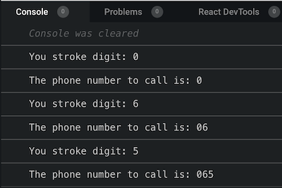
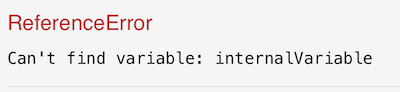

As I started learning to code, one of the first thing I have been told  is the following: 
> "Make sure you understand and master Closures. It is a recurrent topic for tech job interview"

I was not exactly sure why, but I put my head down and started reading about Closures. I then quickly realised that it is one of the most 
confusing concept to learn as a beginner. You can't get it, unless you practice it, meaning write code and play around.

It's exactly like learning to ride a bike as kid. 

1. The theory is not really crystal clear, and it does not help you much to get your bike rolling.
2. The only way to learn riding, is to get on the bike and ride, and probably crash a few times.
3. Then when you finally get your bike rolling, you will most probably not be able to explain it clearly and concisely.

So here is my 2 cents tentative to try to help you make sense of closure as you begin your coder journey. 
By the end of this serie of articles, you should be able to understand below famous tweet, and feel more like an insider 🙂

<div className="Image__Small">
  
</div>

## Some "offical" definition.

Let's start with some definitions from some well known developer resources website.

### MDN 

> A closure is the combination of a function and the lexical environment within which that function was declared.

### 3WS 

> JavaScript variables can belong to the local or global scope. Global variables can be made local (private) with closures.

### Wikipedia 

> In programming languages, a closure, also lexical closure or function closure, is a technique for implementing lexically scoped name binding in a language with first-class functions.


Right, confused yet? I bet you are. So let's just try to ride the bike along and see what happen once the wheels start rolling ...

## The phone dial pad

Most tutorials about closure will make you build a "counter" to practice and understand closure. 
I wanted to find another way to illustrate Closure to make sure that I actually understand what I am trying to make you understand ... 
A phone dial pad seems to be a good alternative.

Disclaimer: To make this article as light as possible we will not build any UI. Rather we will use raw functions to simulate the interactions with the pad,
and the console to simulate the screen display.

### Step #1, the phone pad

Below is the first version of or phone dial pad.

```javascript 
// Function declaration
function phonePad () {
  console.log('I am a phone pad');
}
// invoke the function
phonePad(); // Output 'I am a phone pad'
```

Pretty simple right? Next, we want to be able to tell the Pad which digit has been selected to make up the phone number. 
For that, we will pass the each digit as an argument to phonePad() function.

```javascript
function phonePad (digit) {
  console.log('You pressed digit: ' + digit);
}
// invoke the function with digit #3 passed as a string
phonePad('3'); // 'You pressed digit:  3'
```
So far so good! but this does not constitute a phone number, we want to dial the entire 10 digits right? 
So lets keep invoking phonePad() abd pass in the series of digits that constitute the phone number we intend to call.

```javascript
function phonePad (digit) {
  console.log('You selected digit: ' + digit);
}
// invoke phonePad function for each selected digit
phonePad('0'); // 'You selected digit:  0'
phonePad('6'); // 'You selected digit:  6'
phonePad('5'); // 'You selected digit:  5'
phonePad('7'); // 'You selected digit:  7'
```

OK, you realised quickly that our phonePad() function do not actually remember any of the previous digit selected.
Therefore our console keep printing only the last digit received.
We need some memory !

### Step #2 give the pad some memory

So lets try to give the pad some memory. We can create a variable to store each new digit received. 
With ES6 syntax we would declare a "let" variable and give it the received number inside phonePad().

```javascript
// intialise the number to an empty string
let dialledNumber = '';

function phonePad (digit) {
  console.log('You selected digit: ' + digit);
  // concatanate each new digit to build the dialled number
  dialledNumber = dialledNumber.concat(digit);
  console.log('The phone number to call is: ' + digit);
}

phonePad('0'); 
phonePad('6');
phonePad('5');
```
The console should display something like this
<div className="Image__Small">
  
</div>

Now it looks like we are getting closer to what we are looking for. The console output display the number and each new input 
is concatanated with the previous one. 
However this code has a major flaw as we will see later. But first lets take note of a verify important concept
that is part of the building blocs of closure: Lexical scope.

### Step #3 understading lexical scope

As you can see, our phonePad() function is able to read and mutate the variable "dialledNumber".
The variable "dialledNumber" behave like a global variable, and therefore it is reachable by phonePad().
In short, "dialledNumber" is in the lexical scope of phonePad(). 

However, lets play around and create a variable called "internalToPhonePad". We will declare this variable inside the phonePad(). 
This variable will not be reachable outside of phonePad() curly brackets {} bloc. 
If we try to read or mutate it from outside, then the code would break. 
We can say that "internalToPhonePad" is not in the lexical scope of its surrounding environment. 

```javascript
function phonePad (digit) {
  // declaring a variable inside phonePad()
  const internalToPhonePad = "inside phonePad()"
}
// trying to access internaVariable from the outside breaks the code
console.log(internalToPhonePad);
```

<div className="Image__Small">
  
</div>

Yes, Lexical scope can expend only one way : inside --> out. When a function need to process a variable, it will look first inside
its curly brackets {} bolc. If it cannot find it inside, then it will look for it outside of that bloc. 
In short, phonePad() can see outside of its {} bracket scope, but the outside cannot see what happens inside phonePad().

In the [next article](../closure-part-2-nested-function) we will talk about nested function and referencing
