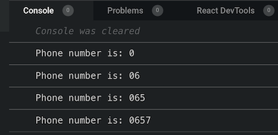

## Follow along from Part I

In my [previous article](../closure-part-1-lexical-scope), we have covered the concept of Lexical Scope, a building bloc to understand closure. 
We have seen that we can use a variable to keep track of the digits selected from the phone pad. There was also a "warning" that
at this stage, there is a big flaw in our code, even if we have the result we wanted (remembering each digit secletion). 
In this article, we will talk about how to fix the flaw with nested function, also a building bloc to understand and use closure.

### What's the flaw?

At this stage we have the following code 
```javascript
// intialise the number to an empty string
let dialledNumber = '';

function phonePad (digit) {
  // concatanate each new digit to build the dialled number
  dialledNumber = dialledNumber.concat(digit);
  console.log('The phone number to call is: ' + dialledNumber);
}

phonePad('0'); // The phone number to call is: 0
phonePad('6'); // The phone number to call is: 06
phonePad('5'); // The phone number to call is: 065
```
It does the job, we are able to store each new digit in the "dialledNumber" variable. And because "dialledNumber" is in the Lexical scope
of phonePad() we are all good ...

However, "dialledNumber" is acting like a global variable (accessible/mutable by any intermediat scripts), it is therefore "unprotected".
That means that "dialledNumber" can accidently (or not) be used for another puroposes, and our phone pad logic would be broken.
The line 13 below will break the app

```javascript
// intialise the number to an empty string
let dialledNumber = '';

function phonePad (digit) {
  dialledNumber = dialledNumber.concat(digit);
  console.log('The phone number to call is: ' + dialledNumber);
}

phonePad('0'); // The phone number to call is: 0
phonePad('6'); // The phone number to call is: 06
// next line will mess up our phone pad memory
dialledNumber = "Random assigment"
phonePad('5'); // The phone number to call is: Random assigment5
```

### Protecting the pad memory

We need to find a way to protected "dialledNumber" variable. We can do just that moving it inside phonePad(). 
This will make accessible only from within phonePad as it is off the global scope now.

So lets try that here

```javascript
function phonePad (digit) {
  // intialise the number inside phonePad
  let dialledNumber = '';

  dialledNumber = dialledNumber.concat(digit);
  console.log('The phone number to call is: ' + dialledNumber);
}
phonePad('0'); // The phone number to call is: 0
phonePad('6'); // The phone number to call is: 6
phonePad('5'); // The phone number to call is: 7
```

But wait! what happened? the phonePad memory is gone !

Whats happening here is that, each time we call phonePad(), javascript creates a brand new instance of that function. 
The previous onces just went to "garbage collector". Then how do we get back that memory while still keeping "dialledNumber" proteced?

We can do that in two folds. 1. create a nested function 2. create a reference to the nested function.

### Nested function & Reference

It name says it all. A nested function, is a function iside (nested) another function. We will nest it inside phonePad(). 
But we also have to follow extra steps to make it working :

1. Nest an anonymous function inside phonePad()
2. Move "digit" argument from phonePad() to the anonymous function(digit)
3. Return the anonymous function
4. Return the dialledNumber variable from the anonymous function scope
5. Assign phonePad() function to a "pad" variable
6. Use the variable "pad" to pass the selected digits

The code should look like this

```javascript
function phonePad () {
  // intialise the number string
  let dialledNumber = "Phone number is: ";
  // declare the nested function receiving digits as argument
  // And return it
  return function (digit){
    // concatanate each new digit to build the phone number
    dialledNumber = dialledNumber.concat(digit);
    // return the concatanated digits
    return dialledNumber
  }
}
// assign phonePad() to a variable that 
// will serve as reference/link
const pad = phonePad()
// send each new nmuber to pad()
// and display the phone number
console.log(pad(0))
console.log(pad(6))
console.log(pad(5))
console.log(pad(7))
```
And the output

<div className="Image__Small">
  
</div>

Voila! Remember, by default functions in javascripts can not hold sate (information) beyond 
its instance life cycle. What we did here is to enable just that by:

1. Protecting "dialledNumber", making it a "private" variable that can hold state.
2. Nesting a function that take care of updating of the state (protected variable "dialledNumber")
3. Keeping phonePad() instance "alive" by using a reference to its nested function.

The 3 above steps are what Closure is all about :)

You probably still wonder how Closures are being used concretly to make things happen in "real" app ...

That will be the subject of the last article for this serie for a perfect Closure ;)

