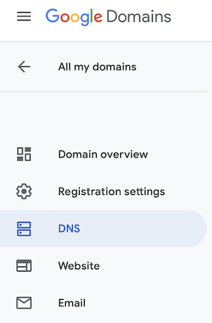
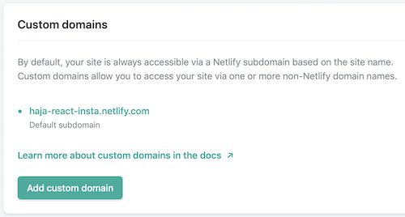
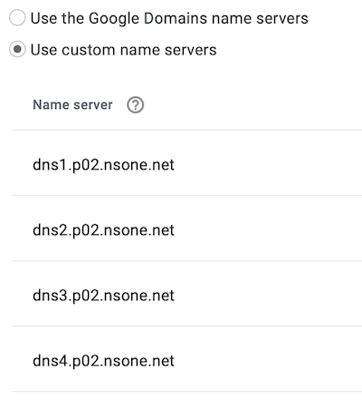

# Netlify 

What can i say about Netlify ... Not much beside it feels like a magic box really. When you deploy your
site with Netlify, everything just run smoothly, like magic. On top of that, they provide you with free access and number of
sites deployments that are more than what you will ever need for your side projects.

### Custom domain.

Each site you deploy on Netlify will allocated to a funny/cool URL. You can also customize it the way you want for free,
as long as you keep `netlify.com` at the end of the URL. 
You can also buy a domain name directly from Netlify, should you want to have full customization of your URL.
However, to date, there are limitations on the class of domain extensions you can buy through Netlify. 
I believe they can be more expensive as well for the same domain name compared to a specialized provider. 

# Google domain

Google recently launched a platform to buy domains names, and to manage your site on the same platform. 
Buying is straight forward, and it has the kind of reach you would expect from Google. 
However, as I said earlier, we are miles away from the kind of experience Netlify provides when 
it comes to deploying and manage your site... So why not get the best of both? Here is how to proceed.

# Linking a custom domain with Netlify

### Step one: Buy domain on Google 

I am not going to cover this part in details here as it is really straight forward. 

1. Go on https://domains.google
2. Search for your drean domain name (This could actually the hardest part)
3. Once found, add to your bucket and checkout.

Once you are done with the steps above, you should land on a screen with the following menu. Click on the button called `DNS`

  

Once you clicked on `DNS` it will open the DNS default setting. And the `Use the Google Domains name servers` will be selected 
by default. Select `Use custom name servers` instead so you can customize the setting.

  

### Step two: Get info from Netlify

Now open another tab to open your Netlify dasboard. 

1. Click on the site you want to use with your new domain name
2. Click on the button called `Domain settings` from the box at the top of the page
3. Then, from the menu on the left, select `Domain management` then `Domains`
4. Finally you should see a green button called `Add custom domain`

  

Click on `Add custom domain` then you will be prompted to enter the domain you want to use. This is where you enter the 
domain name you just purchased from Google. Then click verify.

Netlify will check if the domain is available, and since you purchased it, then it wont be available. 

But fear not! You can still assign the domain to your site by clicking on `Yes, add domain`

  

Once you've done that, Netlify will make the DNS info you need available in your domain settings and management. 
This is what you will need to finalise your setting from Google side. As far as Netlify is concerned, you are done!
Yead, told you, Netfliy is dead simple ...

  

### Step three: Back to Google domain

Now back to Google domain for the final setup. All you have to do really, is to :

1. Click on `Use custom name servers`.
2. Add the DNS info that you can copy and paste from Netlify.
3. Deactivate the `DNSSEC` (Google will ask you this if you dont)
4. Then save !

  

Thats it ! It can take few hours for the linking to be operational but when i did this, the linkage was almost instant!

See you on the next read !
