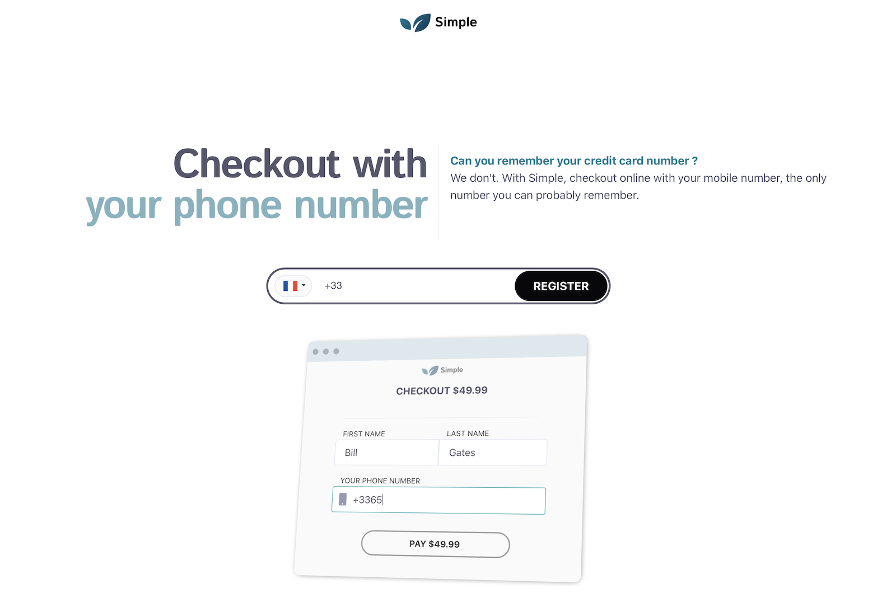

# Passion for Building 

I have a real passion for building things. Sometime, I wish we could have more than 24 hours in a day, 
or that I could sleep less than 5 hours per night. Unfortnatetly, none of them are possible 😆. 
So this is what I am building on my spare times. They all have the following in common :

1. I am not a designer, but I always try to put specific attention/effort in my work estetics. 
The bar is ever increasing to give users the best experience possible. And I believe that estetics play a great role in that regard.

2. Every project that I start must be driven by a real need. Oftenly, something 
that i would want and/or use myself.

3. I like working as a team. It creates accountability and optimize opportunities for learnings. For most projects listed here, I have convinced a small and lean team to join me along 👨‍💻.

# Clezer

[Clezer](http://clezer.app) was specialized in innovative payment. We introduced the first shared debit card for groups, able to debit multiple accounts in real time.
And a chat bot to help groups to split any payments in real time.

  

# Flyaway

Have you ever been in this situation where you feel the need to go for a short break, 
you have saved a little budget to travel ... But then where to go?  
Well, this is where [flyaway.app](http://flyaway.app) flights Inspiration search can come really handy 😀. 
It provides a list of possible destinations from your chosen origin, with a single search.

  

# Codelify

Code Snippets are everywhere in developers info stream: Twitter, stack overflow, tutorials, medium/blog articles ... However, there is no way to easily and efficiently store, organise, index and search them for futur use.  
[Codelify](http://bit.ly/codelify) is the tool to go to, to resolve this challenge.

  

# Dotpay

Getting paid for businesses that provide services or sale goods offline can be cumbursome. They mostly have to deal with cheques, bank transfert, or worse cash.  
[Dotpay](http://bit.ly/dotpayio) provide a simple yet efficient solution for them to easily collect payment online through sharable unique link.

  

# Station (wip)

Most, real estate agencies and coworking space businesses, are still managing their leasing contract and related payments, like in the late nineties 😅. They process paper based contract signature (print => sign => scan => email). Then, rollout paper based bank debit autorisation for rent collection, forced to deal with there banks ugly, non UX-driven interface on monthly basis.  
[Station](http://bit.ly/getonstation) bring them back to the future with electronic contract management and signature, blended with automated invoicing and payment collections. Just like simple online subscription.

  

# Simple
No one can or want to remember their credit card number, but everyone knows their phone number and email address. So why not securely checkout online with the thing that you already know by heart, without looking for your wallet?  
[Simple](http://bit.ly/usesimple) allow just that, its faster 🚀, simpler 👌, and yet safer 🔐.

  

