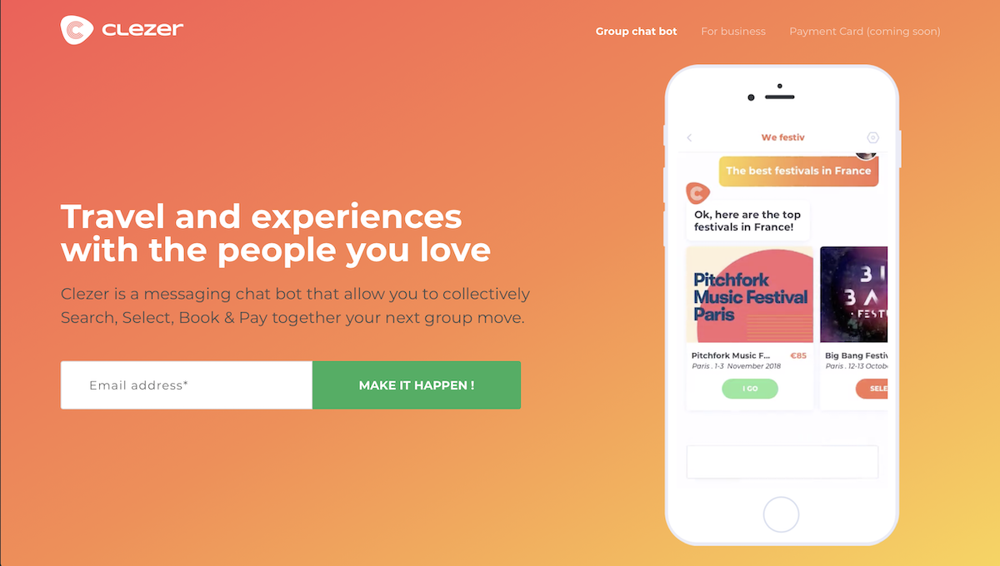
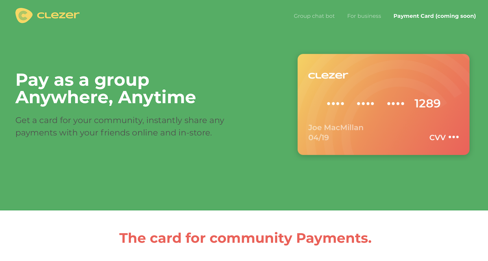
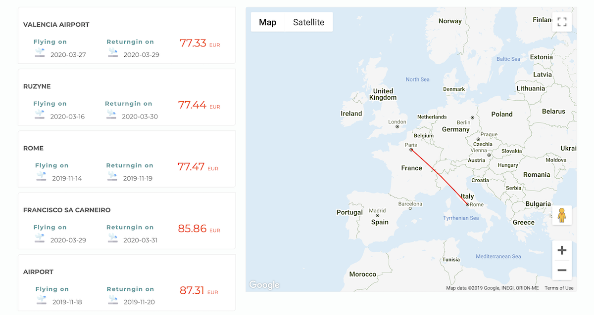
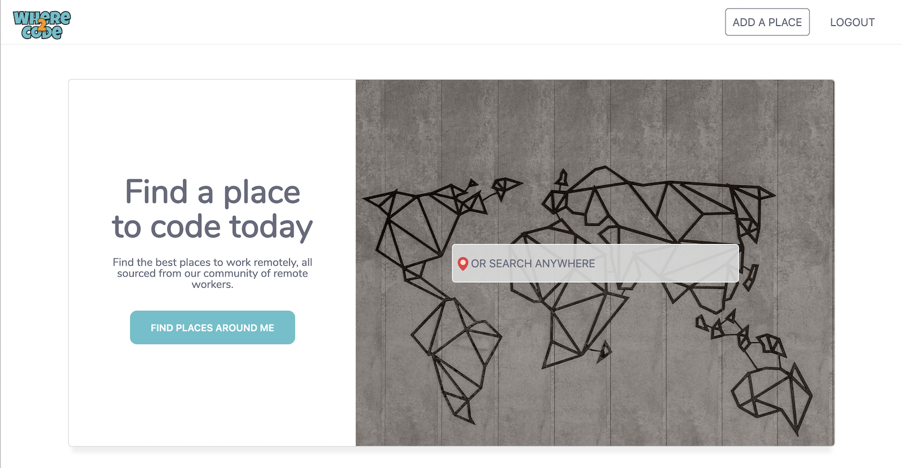

# Just Passion 

I have a real passion for building things that matters. Sometime, actually often, i wish we could have more than 24 hours in a day.
Or I could sleep less than 5 hours per night, so that I could have enough spare time to build the things I have on my todo list. Unfortnatetly, none of them are true nor possible. 
So this is what I have built on my spare time. 
What all these projects have in common is that :

1. I always put specific attention/effort in my work estetics. even if i am not a designer
myself. The bar is ever increasing to make users feel home when they browse your site. And i believe that estetics
play a great role for that.    

2. Every single project that I carry on (when i have time) must be driven by a real mission. Oftenly, something 
that i would want and/or use myself.

# Clezer

Ideas often come from personal experiences, good or bad ones… in Clezer case it was another get together weekend
with some of my best friends. The full story can be read [here](https://medium.com/clezer/the-light-bulb-week-end-how-clezer-became-an-evidence-1be8cca4963f).

[Clezer](http://clezer.com) was specialised in innovative payment. We introduced the first shared debit card for groups, able to debit multiple accounts in real time.
And a chat bot to help groups to split any payments in real time.

  

  

# Flyaway

Have you ever been in this situation where you feel the need to go for a short break, 
you have saved a little budget to travel ... But then where to go? 
In most cases you will end-up bouncing from one travel websites, search engines to another, then filter down to your budget 
and dates constraints. 

It could be so tiring to the point that you give-up on your break well deserved break :(. 
Well, this is where [flyaway.app](http://flyaway.app) flights Inspiration search can come really handy :). 
From a single search, we provide travel inspirations with a list of flight possible destinations.

Where can I fly to from Paris in the next months for 200 euros? flyaway.app can tell you all ... Have fun !

  

  

# Where To Code

Finding out a place to work from when you are working remotly can be tedious. [WhereToCode](https://wtc-haja.netlify.com) enables you 
to find a place based on your location and/or criteria, as well as comprehensive informations about each place. 

### Key Features

- Find a place to work from around you
- Clear information on each location 
- Create and add locations to share with other coders
- Filtering and rating for each location

  

