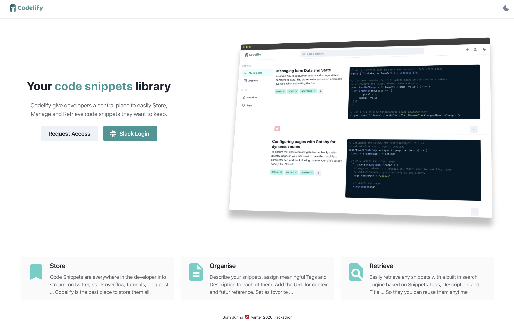
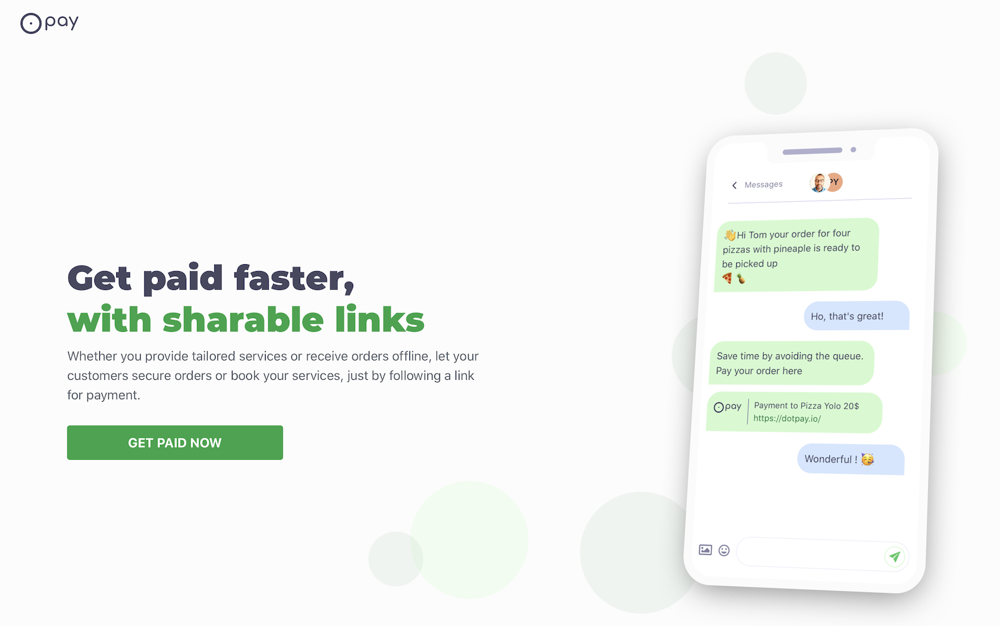
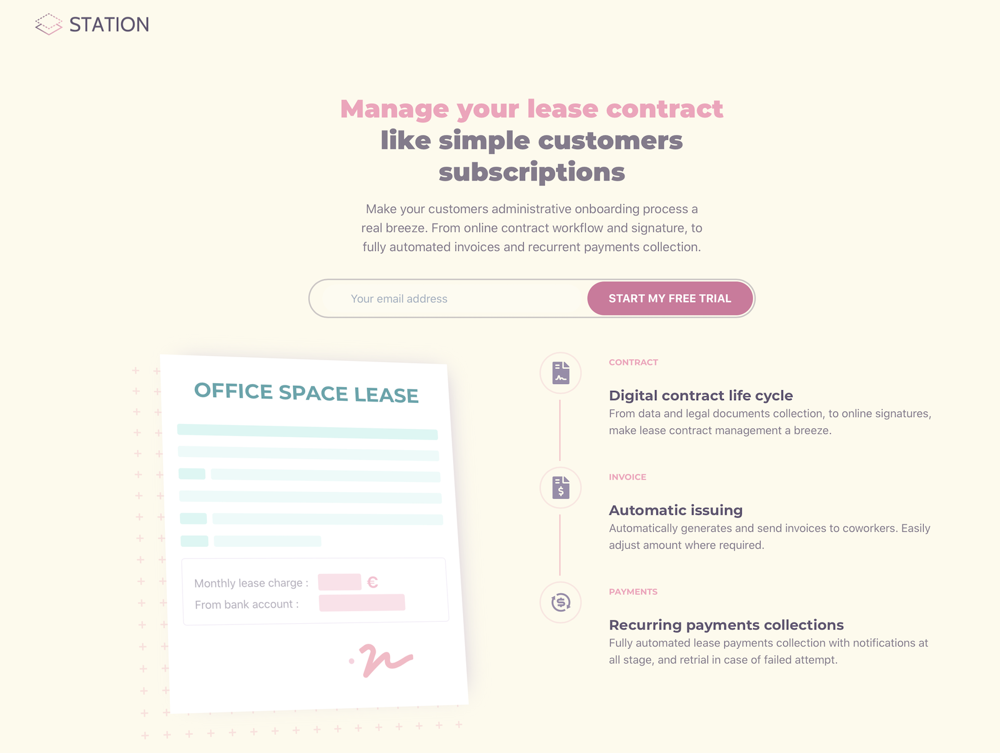

# Passion for Building 

I have a real passion for building things. Sometime, I wish we could have more than 24 hours in a day, 
or that I could sleep less than 5 hours per night. Unfortnatetly, none of them are true nor possible. 
So this is what I have built on my spare time. All these projects have in common the following :

1. I not a designer but I always put specific attention/effort in my work estetics. 
The bar is ever increasing to give users the best experience possible when they visit your site. And i believe that estetics play a great role (out of many others) for that.

2. Every single side project that I start (when i have time) must be driven by a real need. Oftenly, something 
that i would want and/or use myself.

3. I like working with a team, it creates accountability and optimize opportunities for learning. For most of my projects, I convinced a small and lean team to join me along.

# Clezer

Ideas often come from personal experiences, good or bad ones… in Clezer case it was another get together weekend
with some of my best friends. The full story can be read [here](https://medium.com/clezer/the-light-bulb-week-end-how-clezer-became-an-evidence-1be8cca4963f).

[Clezer](http://clezer.com) was specialised in innovative payment. We introduced the first shared debit card for groups, able to debit multiple accounts in real time.
And a chat bot to help groups to split any payments in real time.

  

# Flyaway

Have you ever been in this situation where you feel the need to go for a short break, 
you have saved a little budget to travel ... But then where to go? 
In most cases you will end-up bouncing from one travel websites, search engines to another, then filter down to your budget 
and dates constraints. 

It could be so tiring to the point that you give-up on your well deserved break 😟. 
Well, this is where [flyaway.app](http://flyaway.app) flights Inspiration search can come really handy 😀. 
It provides a list of possible destinations from your chosen origin, with a single search.

  

# Codelify

Code Snippets are everywhere in the developer info stream, on twitter, stack overflow, tutorials, medium/blog articles ... However, there is no way to easily and efficiently store, organise, index and search them for futur use.
[Codelify](http://bit.ly/codelify) is the tool to go to, to resolve this challenge.

  

# Dotpay

Getting paid for businesses that provide services or sale goods offline can be cumbursome. They mostly have to deal with cheques, bank transfert, or worse cash. 
Dotpay provide a simple yet efficient solution for them to easily collect payment online through sharable unique link.

  

# Station

Most, real estate agency and coworking space business, are still managing their leasing contract and related payments, like in the late nineties 😅. They process paper based contract signature (print => sign => scan => email). Then, rollout paper based bank debit autorisation for rent collection, forced to deal with there banks ugly, non UX-driven interface on monthly basis.

Station bring them back to the future with electronic contract management and signature, blended with automated invoicing and payment collections. Just like simple online subscription.

  

