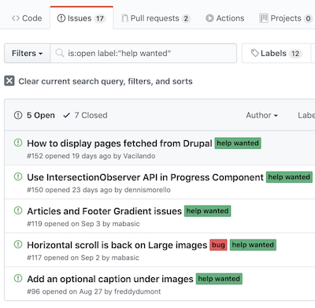
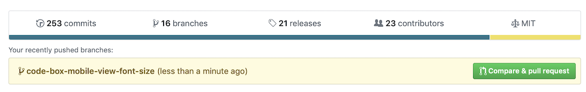
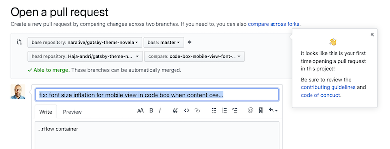
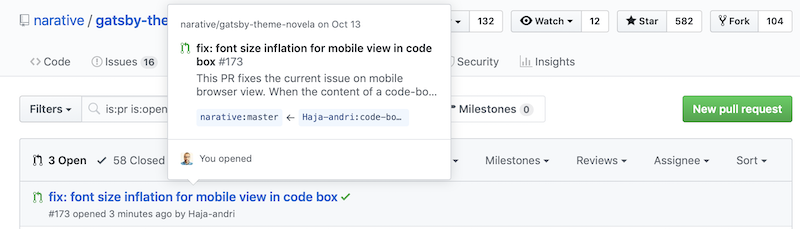

<div style="width:80%;display:flex;justify-content:flex-end;padding-left:100px;">
<a style="margin-right:0px;width:170px;color:grey;text-decoration:none;padding:4px 6px;font-size:12px;line-height:1.2;display:inline-block;border-radius:3px" href="https://unsplash.com/@will0629?utm_medium=referral&amp;utm_campaign=photographer-credit&amp;utm_content=creditBadge" target="_blank"><span style="display:inline-block;padding:2px 3px"><svg xmlns="http://www.w3.org/2000/svg" style="height:12px;width:auto;position:relative;vertical-align:middle;top:-2px;fill:white" viewBox="0 0 32 32"><title>unsplash-logo</title><path d="M10 9V0h12v9H10zm12 5h10v18H0V14h10v9h12v-9z"></path></svg></span><span style="display:inline-block;padding:2px 3px">Hero credit: Will Porada</span></a>
</div>


# The right time is now 

I clearly remember that during the last Q&A session of covering Javascrip at Lamdda School, I asked only one question to 
my instructor @Gab:

> When do you think we would be ready to start to contribute to an open source project?

And guess what was his answer?  ... One word:

> Now

Like many of us starting to learn to code, you start your learning journey with huge `bagage` that can stick around 
for(ever?) a long time. And that bagage is called `imposter syndrom`. It can be more or less heavy depending on your 
background and where you are in your journey, but it is definitly something that you want to get rid of, as soon as possible.

So, even if his answer kept me skeptical at the time, I now know that his answer was what any great teacher would have given us.

Yes, NOW is the time, because this imposter syndrome can persist and will keep preventing you to do what you are actually capable doing.
Which are: Solving problems, enhancing stuff, Asking questions and helps ... !

# If "when is now", then where do I start?

OK, I hear you, that's great but where/how do I start? I dont think there is only one way of getting started. But to me
the base line is just to stop overthinking it. There are several possible paths that you can explore and/or combine to get
started. But here I am going to share the process that lead me to my first contribution to an external project.

### Step one: Start building

You dont need to go for the biggest, most popular open source project. Just start a side project on your own. 
Or make stretch on your existing ones (push the limits of your todo_list app?). 
Or build something you want to use yourself ... Basically anything that keep pushing you to level up your coding skills by building.

By doing/staring something, you will most probably struggle, if not, then you are not pushing your game hard enough.  

Often time, when you struggle on something, you end up searching solutions/answers on Google. You must know it by now, there are no
struggles that you are facing, that no one else have faced before you. This search can lead you to two outcomes:

1. You found something on stackoverflow, in an article, a blog post .. and you just inject/adapt the solution to your code. As long as you understand the solution, it is still progress.
2. You found a (npm) package that provide the solution partially or entirely out of the box (I will write an article about npm packages on beginners)

### Step two: Spot issues, possible enhancements

If you end-up with the first path, keep going until the next struggle (It should come soon enough :)

If you end-up using an external package, this is where it could get interresting. Indeed, there is a big chance that you see stuff that can be 
improved or customized to your specific needs. Even better, you spot a bug ...

In my case, I just wanted to fix the mobile rendering of the code-box font size of the Theme I am currently using for my Gatsby blog. 

Alternatively, if you really like the solution/package you are using but you cant find anything to fixe or improve, you can 
go and check the solution git repo. Most open source project will have a section for issues listing. Issues can even have a labels
so you can easily spot the severity/priority of each of them.

<div className="Image__Small">
  
</div>

In my case again, the issue I have spotted (and fixed it locally) was already listed in the issue list, and it was labeled as `Help needed`. 
So i was quite happy about that, and even more because they were not able to make progress on it for a while. 


# Take ownership

### Step three: Fork, Clone, Code

Once you have identified something that you think is worth fixing/improving/customizing, take ownership of it. 

Fork the repo so you have it copied (and linked) on your own git repo. Than, clone the forked repo to your local machine
```
git clone https://github.com/Organisation/repo.git
```

Open the folder with VS Code or your favorite code editor. Than, create a branch for your fixe

```
git checkout -b branch-name-for-fixe
```

Investigate, and code ...

### Step four: Open a Pull Request (PR)

Once you are done with the fixes/enhancements locally, and tested it then Commit your work (this should be done along the way) and push
it to the remote git repo

```
git add .
git commit -m "clear message describing your commit intends and completed steps"
git push origin branch-name-for-fixe
```

The above steps will automatically generate a message on your git repo (web) asking you to `Compare and Pull Request`

<div className="Image__Small">
  
</div>

Click on the green button. Then you will have to verify/confirm the repos referenced in your PR. Make sure that the 
`base master` point to the original repo (on the left hand side). And your head repository (your Fork) compare to your branch
on the right hand side.

Also make sure that you describe with as much details as possible your fixes (source, solution, test, ...). You may also 
see a message asking you to read the `Contribution guideline`. In fact this the first thing you should be doing before even
creating the PR.

<div className="Image__Small">
  
</div>

Then finally, click on the green button at the button called `Create Pull Request`

And thats it ! The project owner(s) will receive a notification about your PR. 
Based on how busy they are and how big is your PR, it could be more or less fast for them to get back to you and eventually merge your work to the master.
In any case check that your PR is listed in the `Pull Request` section of the repo. You can even open a discussion with the project owners if needed, 
some will be more reactive than others but it worth trying.

Now, go and make something worth your time, you own this! 

<div className="Image__Small">
  
</div>