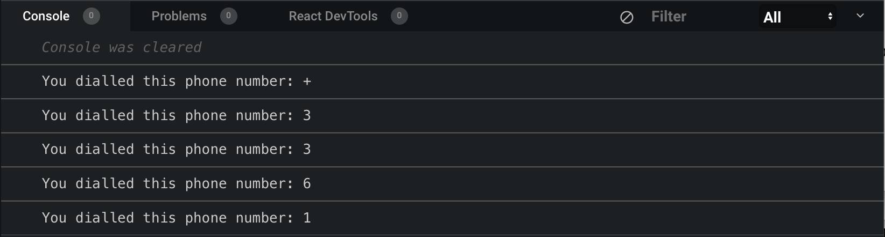

One the first thing I have being told as I started learning to code is : 
> "Make sure you understand and master the concept of closure. It is a recurrent topic for tech job interview"

So I put my head on on it, and quickly found out that it is one of the most confusing concept to learn as a beginner. Then, when  you finally kind of reach the “I get it” state; You are unable to explain it clearly without confusing other begginers

It's exactly like when as kid, you get on learning how to ride bicycle. 

1. The theory sucks and it does not help much to make your first ride. 
2. The only way to actually make progress, is to practice, and probably crash a few times.
3. Then when you finally get it and rides, you wont be able to explain what's the theory around it ...

So here is my 2 cents article to try to make sense of closure as you begin your coder journey. By the end of this article, you should be able to understand this now famous tweet, and hopefully you will feel more like an insider 🙂

<div className="Image__Small">
  
</div>

## Some definition.

We will learn about closure by making it real with a minimalistic app (if I can actually call it an app), but first here are some definition from some well known developper resources website.

### MDN 

> A closure is the combination of a function and the lexical environment within which that function was declared.

### 3WS 

> JavaScript variables can belong to the local or global scope. Global variables can be made local (private) with closures.

### Wikipedia 

> In programming languages, a closure, also lexical closure or function closure, is a technique for implementing lexically scoped name binding in a language with first-class functions.


Right, hmmm, confused yet? I bet you are. So let's just try to ride the bike and see what happen once the wheels start rolling ...

## The phone dial pad

Most resources around closure will make you use a "counter" to practice and understand closure. I decided to find another way of illustrating this concept so I make sure that I fully understand what I am actually trying to make you understand.. so we will make a dialling phone pad instead of the "traditional" counter.

To make this article as light as possible we will not build any UI but rather make use of functions to simulate the pad, and console logs to simulate the screen that display the numbers been dialled.

### Step #1 we need a phone pad

Let's juste make a raw function for now. I will assume that you understand the basic concept of js functions here and you probably already wrote some.

```javascript 
// declare the function
function phonePad () {
  console.log('i am a phone pad');
}

// invoke the function
phonePad(); // Output 'i am a phone pad'
```

Next we want to be able to tell the Pad what number is being dialled from the pad, so we will just pass that number (strokedDigit) as an argument to phonePad function.

```javascript
function phonePad (strokedDigit) {
  console.log('You dialled this phone number: ' + strokedDigit);
}

// invoke the function with digit #3 passed as a string
phonePad('3'); // Console output 'You dialled this phone number: 3'
```
So far so good ! but this does not constitute a phone number, we want to dial in the entire 10 digits like "+33617570159" right ? So lets keep invoking our phonePad function passing in the series of digits that constitute the phone number we want to call.

```javascript
function phonePad (strokedDigit) {
  console.log('You dialled this phone number: ' + strokedDigit);
}

// invoke phonePad function for each stroke 
phonePad('+');
phonePad('3');
phonePad('3');
phonePad('6');
phonePad('1');
```

Hey ! you probably stopped before the end as you realise that our phonePad function as no way of remembering the last key stroke, and each new stroke just replace the the previous one. 
And your console keep doisplaying only the last digit stroked as shown below.

<div className="Image__Small">
  
</div>

### Step #2 we need some memory

So lets try to give it some memory by setting a local variable (variable that belong to the function). With ES6 syntax we would declare a "let" variable in the function and assign to it the received number being stroked.

```javascript
function phonePad (strokedDigit) {
  // intialise the number to an empty string
  let dialledNumber = '';
  // concatanate each stroke to memorize/build the dialled number
  dialledNumber = dialledNumber.concat(strokedDigit);
  console.log('You dialled this phone number: ' + dialledNumber);
}
```

Ouch ! same result ! we still do not have any memory of the strokes 😞 . What happened here is that each time we invoke phonePad() function, a new instance of that function is created by Javascript,  and we have no reference available to refer to the previous invocation ... damm !. 

### Step #3 nested function

In addition to local variable, we create a a nested function (inside phonePad) that we will call "stoke" to process each stroke received by phonePad. We will move the concat operation inside this nested function (stoke);

```javascript
function phonePad (strokedDigit) {
  // intialise the number to an empty string
  let dialledNumber = '';
  //declare the nested function
  function stroke (){
    // concatanate each stroke to memorize/build the dialled number
    dialledNumber = dialledNumber.concat(strokedDigit);
  }
  // invoke stroke
  stroke();
  console.log('You dialled this phone number: ' + dialledNumber);
}
```

OK, you got me, we still don't have any memory. But I want you to notice one very important concept in Javascript that you need to understand to truly understand Closure: Lexical scope.

### Step #4 understanding lexical scope

As you can see in the function above, we are invoking the "stroke" function without passing in any arguments. Yet, stroke function is still able to reach/find the variables that it needs (strokedDigit and dialledNumber) to execute... 

Basically the stroke() function will first search locally (within its curly bracket {} scope ) the declaration/initialisation of the variables to process. If it does not find them locally, it has the ability to search for them outside the {} scope. 
This is what is called Lexical scope (as far as I understand it as of today). 

However Lexical scope are only one way : inside/out search. So if you declare a variable inside the nested stroke() function and try to use it outside of stroke {} scope, it will generate an error. 
That is because of the inside->out only reach. In plain English (or Fran-glish) stroke() can see outside its {} bracket scope, but the outside cannot see what has been declared inside stroke().

The following will break the Pad

```javascript
function phonePad (strokedDigit) {
  ...
  function stroke (){
    // loca variable declared inside stroke
    const localVariableToStroke = 'stoke local variable';
    console.log(localVariableToStroke);  
  }
  // Console output 'stroke local variable'
  stroke(); 
  // Error! localVariableToStroke not reachable !
  console.log(localVariableToStroke); 
}
```

### To be continued ...