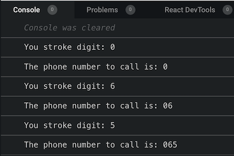
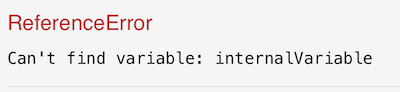

As I started learning to code, one of the first thing I have being told  is the following: 
> "Make sure you understand and master closures. It is a recurrent topic for tech related job interview"

So I put my head down and started reading about closures. I then quickly realised that it is one of the most 
confusing concept to learn as a beginner. And the only way for it to make sense at all, is to actually write code and play around.

It's exactly like learning to ride a bike when as kid. 

1. The theory sucks and it does not help you much to get rolling. 
2. The only way to actually make progress, is to practice, and probably crash a few times.
3. However, when you finally get it rolling and ride around, you probably wont be able to explain it back clearly and concisely.

So here is my 2 cents tentative to try to help you make sense of closure as you begin your coder journey. 
By the end of this serie of articles, you should be able to understand this now famous tweet, and feel more like an insider 🙂

<div className="Image__Small">
  
</div>

## Some definition.

First here are some definition from some well known developper resources website.

### MDN 

> A closure is the combination of a function and the lexical environment within which that function was declared.

### 3WS 

> JavaScript variables can belong to the local or global scope. Global variables can be made local (private) with closures.

### Wikipedia 

> In programming languages, a closure, also lexical closure or function closure, is a technique for implementing lexically scoped name binding in a language with first-class functions.


Right, hmmm, confused yet? I bet you are. So let's just try to ride the bike and see what happen once the wheels start rolling ...

## The phone dial pad

Most resources around closure will make you build a "counter" to practice and understand closure. 
I decided to find another way of illustrating this concept to make sure that I actually fully understand my self what I am trying to make you understand ... 
So we will build a phone dial pad instead of the "traditional" counter.

Disclaimer: To make this article as light as possible we will not build any UI but rather make use of functions to simulate the pad, and console logs to simulate the screen display.

### Step #1, the phone pad

The phone pad will take the for of a raw function at this stage. I will assume that you understand the basic concept of javascript functions, and that you probably already wrote some.

```javascript 
// Function declaration
function phonePad () {
  console.log('i am a phone pad');
}
// invoke the function
phonePad(); // Output 'i am a phone pad'
```

Next we want to be able to tell the Pad which digit is being dialled from the pad. For that we will just pass the stroked digit as an argument to phonePad function.

```javascript
function phonePad (strokedDigit) {
  console.log('You stroke digit: ' + strokedDigit);
}
// invoke the function with digit #3 passed as a string
phonePad('3'); // Console output 'You stroke digit:  3'
```
So far so good ! but this does not constitute a phone number, we want to dial in the entire 10 digits like "0617570159" right? 
So lets keep invoking our phonePad function passing in the series of digits that constitute the phone number we intend to call.

```javascript
function phonePad (strokedDigit) {
  console.log('You stroke digit: ' + strokedDigit);
}
// invoke phonePad function for each stroke 
phonePad('0'); // Console output 'You stroke digit:  0'
phonePad('6'); // Console output 'You stroke digit:  6'
phonePad('5'); // Console output 'You stroke digit:  5'
phonePad('7'); // Console output 'You stroke digit:  7'
```

Hey ! you probably stopped before the end as you realised that our phonePad function 
do not actually remember the previous stroke, and therefore just print the last stroke on the console.

### Step #2 give the pad some memory

So lets try to give the pad some memory with variable to store each new digit stroked. 
With ES6 syntax we would declare a "let" variable and assign to it the received number inside phonePad().

```javascript
// intialise the number to an empty string
let dialledNumber = '';

function phonePad (strokedDigit) {
  console.log('You stroke digit: ' + strokedDigit);
  // concatanate each new stroke to build the dialled number
  dialledNumber = dialledNumber.concat(strokedDigit);
  console.log('The phone number to call is: ' + dialledNumber);
}

phonePad('0'); 
phonePad('6');
phonePad('5');
```
<div className="Image__Xsmall">
  
</div>

OK ! it looks like we are getting closer to what we are looking for. The console output display the number and each new stroke 
is concatanated with the previous one. 
However this code has some major flaws as we will see later. But first lets take note of a verify important concept
that is part of the building blocs of closure: lexical scope.

### Step #3 understading lexical scope

As you can see, our phonePad() function is able to read and mutate the variable "dialledNumber", 
even if it was declared outside of its curly brackets {} scope. The variable "dialledNumber" here, kind of behave like a global variable,
and because it is reachable by phonePad(), we can say it is in the lexical scope of phonePad(). 
However, should we have had a variale "internalVariable" declared within phonePad() brackets {} scope, and try to read or mutate it 
from the outside, then our code would break because "internalVariable" is outside of the lexical scope of 
its surrounding environment 

```javascript
function phonePad (strokedDigit) {
  // declaring a variable inside phonePad()
  const internalVariable = "intialised inside phonePad()"
}
// trying to access internaVariable from the outside
console.log(internalVariable);
```

<div className="Image__Xsmall">
  
</div>

Indeed, lexical scope can expend only one way : inside --> out. 
It basically means that phonePad() can see its direct surrounding outside its {} bracket scope, 
but the outside surrounding cannot see what happens inside phonePad().

In the next article we will talk about nested function and referencing


### Step #3 add nested function

In addition to local variable, we will create a nested function (inside phonePad), we will call it "stoke". This nested function 
will be used for processing each stroke received by phonePad. 
We will move the concat operation inside the nested function (stoke) for that matter;

```javascript
function phonePad (strokedDigit) {
  // intialise the number to an empty string
  let dialledNumber = '';
  //declare the nested function
  function stroke (){
    // concatanate each new stroke to build the phone number
    dialledNumber = dialledNumber.concat(strokedDigit);
  }
  // invoke stroke
  stroke();
  console.log('You dialled this phone number: ' + dialledNumber);
}
```

OK, you got me, we still don't have any memory. But I want you to notice one very important concept in Javascript that you need to understand to truly understand Closure: Lexical scope.

### Step #4 understanding lexical scope

As you can see in the function above, we are invoking the "stroke" function without passing in any arguments. Yet, stroke function is still able to reach/find the variables that it needs (strokedDigit and dialledNumber) to execute... 

Basically the stroke() function will first search locally (within its curly bracket {} scope ) the declaration/initialisation of the variables to process. If it does not find them locally, it has the ability to search for them outside the {} scope. 
This is what is called Lexical scope (as far as I understand it as of today). 

However Lexical scope are only one way : inside/out search. So if you declare a variable inside the nested stroke() function and try to use it outside of stroke {} scope, it will generate an error. 
That is because of the inside->out only reach. In plain English (or Fran-glish) stroke() can see outside its {} bracket scope, but the outside cannot see what has been declared inside stroke().

The following will break the Pad

```javascript
function phonePad (strokedDigit) {
  ...
  function stroke (){
    // local variable declared inside stroke
    const localVariableToStroke = 'stoke local variable';
    console.log(localVariableToStroke);  
  }
  // Console output 'stroke local variable'
  stroke(); 
  // Error! localVariableToStroke not reachable !
  console.log(localVariableToStroke); 
}
```

### To be continued ...